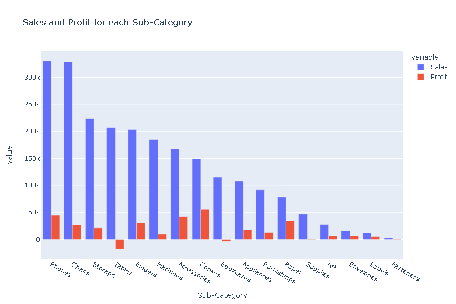
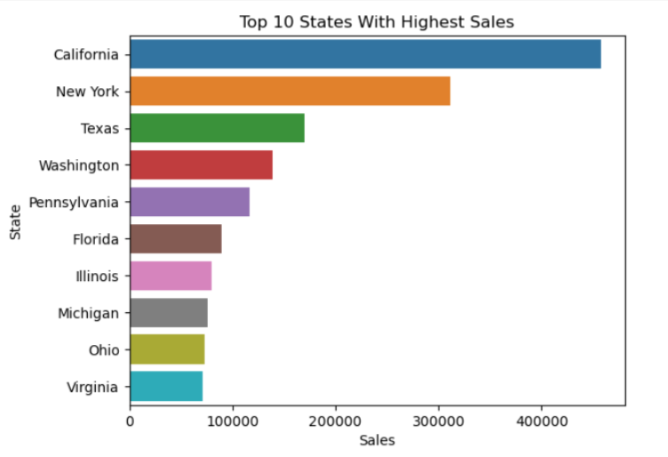
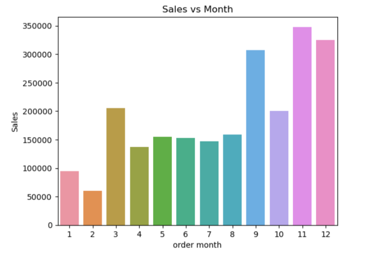

# 📊 Superstore Sales & Profit Analysis

_A comprehensive analysis of a retail superstore's sales data to identify profit leaks, optimize discount strategies, and improve category performance using Python._

---

## 📌 Table of Contents
- <a href="#overview">Overview</a>
- <a href="#business-problem">Business Problem</a>
- <a href="#dataset">Dataset</a>
- <a href="#tools--technologies">Tools & Technologies</a>
- <a href="#project-structure">Project Structure</a>
- <a href="#data-cleaning--preparation">Data Cleaning & Preparation</a>
- <a href="#exploratory-data-analysis-eda">Exploratory Data Analysis (EDA)</a>
- <a href="#key-findings">Key Findings</a>
- <a href="#dashboard">Visualizations</a>
- <a href="#final-recommendations">Final Recommendations</a>
- <a href="#author--contact">Author & Contact</a>

---
<h2><a class="anchor" id="overview"></a>Overview</h2>

This project analyzes retail transaction data from a global superstore to understand the drivers of profitability. While revenue is consistent across categories, profit margins vary drastically. The goal is to provide data-driven recommendations to minimize losses in underperforming sectors (like Furniture) and maximize returns in high-margin areas (like Technology).

---
<h2><a class="anchor" id="dataset"></a>Dataset</h2>

- **Source:** `superstore.csv` (Sample Superstore Dataset)
- **Volume:** 9,994 records, 21 columns
- **Key Attributes:**
  - **Dimensions:** `Region`, `Category`, `Sub-Category`, `Segment`, `City`, `State`
  - **Metrics:** `Sales`, `Quantity`, `Discount`, `Profit`
  ---

<h2><a class="anchor" id="tools--technologies"></a>Tools & Technologies</h2>

- **Python:** Primary language for analysis.
- **Pandas:** Used for data manipulation, aggregation, and cleaning.
- **Matplotlib & Seaborn:** Used for creating static visualizations (bar charts, heatmaps).
- **Plotly:** Used for interactive visualizations (if applicable in your notebook).

---
<h2><a class="anchor" id="project-structure"></a>Project Structure</h2>

```
📂 Project Structure

eda-superstore-sales/
│
├── data/
│      └── superstore.csv       # Original unmodified dataset
│                 
│
├── notebook/
│   └── sales_analysis.ipynb     # Detailed EDA and storytelling
│     
│
├── images/                      # Saved visualizations for documentation
│   ├── subcategory_profit.png
│   ├── top_states.png
│   └── monthly_sales.png
│
├── .gitignore                   # Files to ignore (large data, temp files)
├── README.md                    # Project Documentation
└── requirements.txt             # List of dependencies
```

---
<h2><a class="anchor" id="data-cleaning--preparation"></a>Data Cleaning & Preparation</h2>

- **Data Loading:** Loaded the dataset using Pandas with `Row ID` as the index.
- **Type Handling:** Verified data types for sales, profit, and discount columns.
- **Duplicate Check:** Checked for and removed any duplicate transaction records.
- **Missing Values:** Confirmed the dataset integrity (no critical missing values found in key columns).

---
<h2><a class="anchor" id="exploratory-data-analysis-eda"></a>Exploratory Data Analysis (EDA)</h2>

The analysis focused on:
1.  **Univariate Analysis:** Distribution of Sales and Profit.
2.  **Bivariate Analysis:** Relationship between Discount and Profit (showing a strong negative correlation).
3.  **Category Analysis:** Comparing Sales vs. Profit across Furniture, Office Supplies, and Technology.

---
<h2><a class="anchor" id="key-findings"></a>Key Findings</h2>

1.  **The Furniture Trap:**
    - Furniture generates high sales (**~$742k**) similar to Office Supplies, but its profit is dangerously low (**$18k**).
    - In contrast, Technology generates **$145k** profit on similar sales volume.
2.  **Money Losers:**
    - **Tables** and **Bookcases** are the worst performers, generating significant **negative profit** (losses) despite decent sales numbers.
    - Tables alone resulted in a loss of **-$17,725**.
3.  **Discount Impact:**
    - Discounts greater than **20%** consistently result in financial losses. The "sweet spot" for discounts is between 0-20%.
4.  **Regional Dominance:**
    - The **West** region is the strongest performer in both sales and profit.
    - The **Central** region has the lowest profit margin, largely due to high discounting on furniture.

---
<h2><a class="anchor" id="dashboard"></a>Visualizations</h2>

### 1. Profit vs. Sales by Sub-Category
_This chart reveals the critical business issue: High sales in 'Tables' (blue bar) result in negative profit (red bar). We are effectively paying customers to take this inventory._


### 2. Top 10 States by Sales
_California and New York are the clear market leaders, outperforming the next 8 states combined. Marketing efforts should focus on maintaining dominance here._


### 3. Monthly Sales Trends
_The Q4 spike (Sept-Dec) indicates exactly when marketing spend and inventory stocking should be maximized to capture holiday demand._


---
<h2><a class="anchor" id="final-recommendations"></a>Final Recommendations</h2>

- **Revise Furniture Pricing:** Drastically reduce discounts on Tables and Bookcases. If profitability cannot be improved, consider discontinuing these lines.
- **Discount Control:** Implement a company-wide policy capping discounts at **20%** unless authorized for clearance.
- **Focus on Technology:** Shift marketing budget towards **Copiers, Phones, and Accessories**, which are the highest profit generators.
- **Central Region Strategy:** Investigate the Central region's pricing strategy to stop the profit leakage.

---
<h2><a class="anchor" id="author--contact"></a>Author & Contact</h2>

**Gaurav Kumar Mahato**
📧 Email: gaurav979mahato@gmail.com
🔗 [LinkedIn](https://www.linkedin.com/in/gaurav-kumar-mahato/)